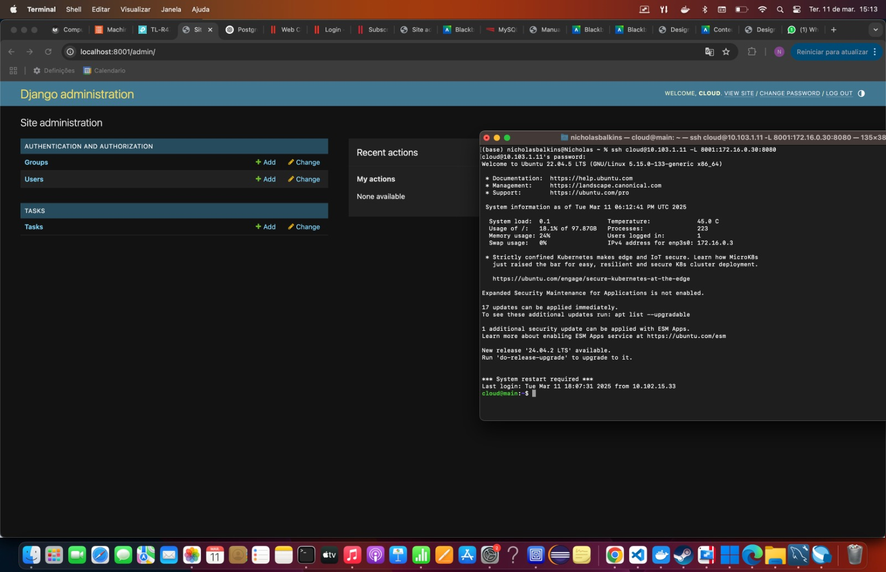

## Objetivo

O objetivo deste roteiro é compreender os conceitos básicos do uso da plataforma MaaS (gerenciamento de hardware), os primeiros passos para configurar uma nuvem e sua administração, além de aprender e aplicar os fundamentos de redes.

### Tarefa 1

Comando Ifconfig para mostrar as configurações:

Rodamos o comando Systemctl no intuito de verificar que o banco de dados está ativo:

Ao Rodar o comando telnet, provamos a conexão do server1 com o banco de dados e sua acessibilidade

Conexão acessivel pela main também:

### Tarefa 2

Exemplo de diagrama

Dashboard do MAAS com as maquinas:

Images com as imagens sincronizadas:

Server1 :

Server2 :

Server3 :

Server4 :

Server5 :

[Mermaid](https://mermaid.js.org/syntax/architecture.html){:target="_blank"}

### Tarefa 3

Dashboard do MAAS com as duas maquinas e respectivos IPs:

Aplicação Django conectada ao server:

Implementação do Django:

1: Deploy no server2:

Para a implementação do Django ser bem sucedida, é necessario fazer o deploy do server2. Sendo assim, pedimos o acesso do maas pelo terminal com o comando : [maas login [login] http://172.16.0.3:5240/MAAS/] para  o informar ao terminal a localização do servidor. 

Após isso, salvamos o token disponível no dashboard e reservamos a máquina server2 via MaaS com o comando:  maas [login] machines allocate name=server2 . Anotamos o resultado do campo system_id pois será necessario no comando de fazer o deploy. Finalmente, fizemos o deploy do server2 com o comando :  maas [login] machine deploy [system_id].

2: Implementação do Django:

Com o server2 já feito o deploy do Ubuntu, utilizamos esse comando : git clone https://github.com/raulikeda/tasks.git para clonar na maquina o repositório no intuito de instalar na maquina o Django. Entramos no diretório tasks e executamos o comando ./install.sh para a instalação. 

Ao realizar o reboot, testamos o serviço na porta 8080.

Apos os passos acima, o Django foi bem instalado e já está conectada a base de dados.

### Tarefa 4

Dashboard do MAAS com as três maquinas e respectivos IPs:

Django conectada ao server 2:

Django conectada ao server 3:

Diferenças e vantagens de implementar utlizando Ansible :

O Ansible é uma ferramenta de automação que simplifica o processo de deploy e gerenciamento de servidores. Se o processo for feito manualmente, inúmeros comandos precisarão ser executados. O Ansible automatiza todas as etapas seguindo um padrão pré-definido pelo programador. Dessa forma, futuros deploys seguirão o mesmo padrão, tornando o processo mais eficiente, reprodutível e fácil de aplicar em múltiplos servidores.

Vantagens do Ansible:
- Automação Completa – Reduz erros manuais e tempo de execução.
- Reprodutibilidade – O mesmo playbook pode ser usado em vários servidores.
- Escalabilidade – Permite gerenciar múltiplos servidores de forma eficiente e padronizada.

Além disso, ao usar o Ansible ele já faz o deploy e instala o Django de forma automatizada.

### Tarefa 5

Dashboard do MAAS com as quatro maquinas e respectivos IPs:

Função index do server 2 e o GET:

Função index do server 3 e o GET:

